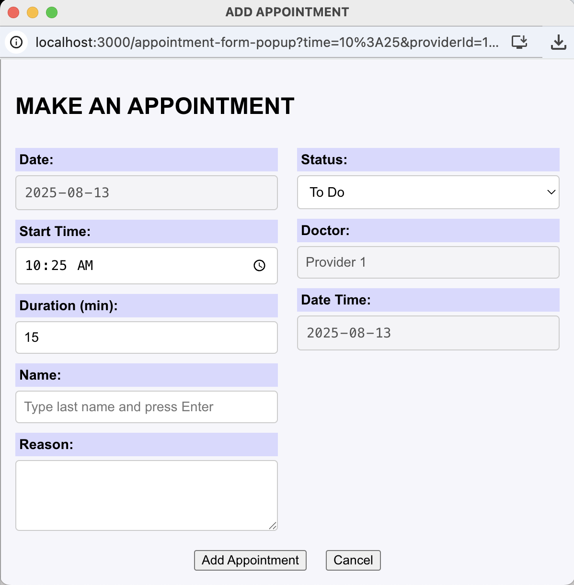
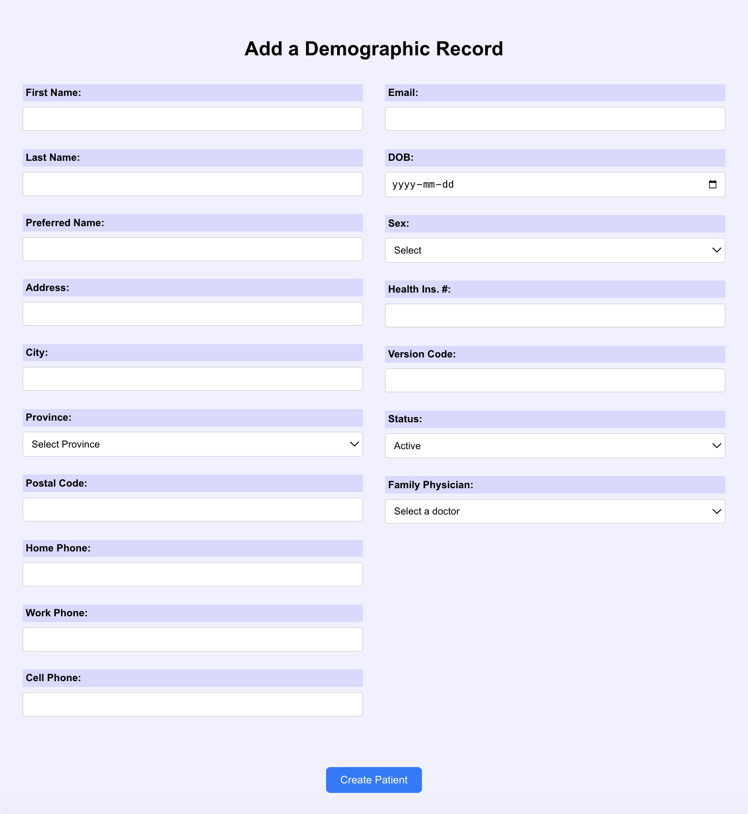
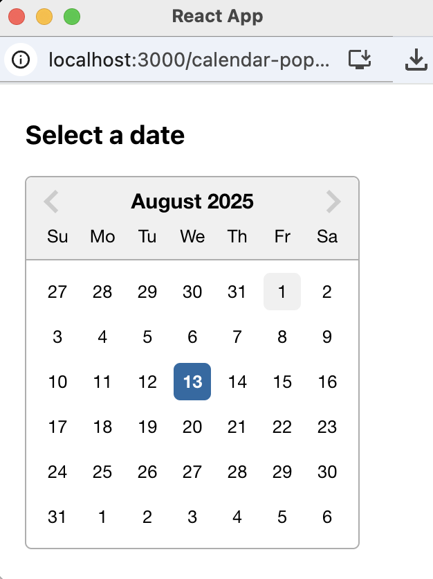
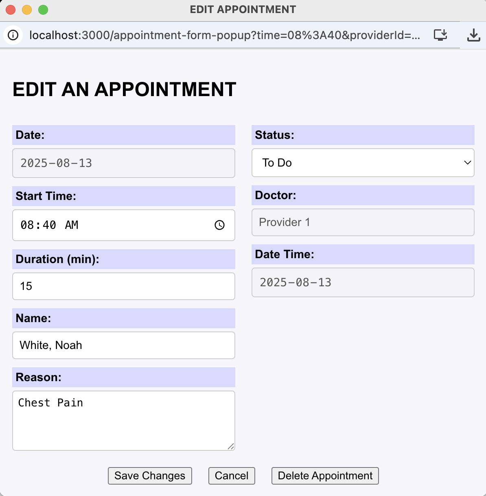
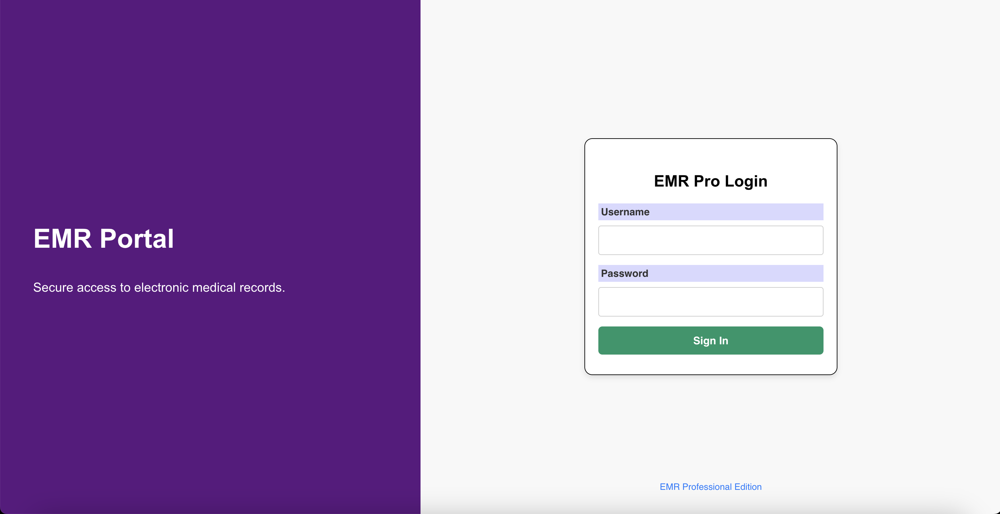
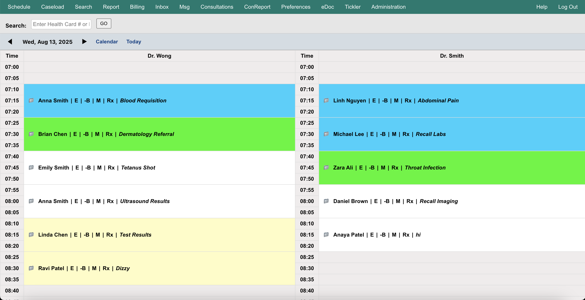
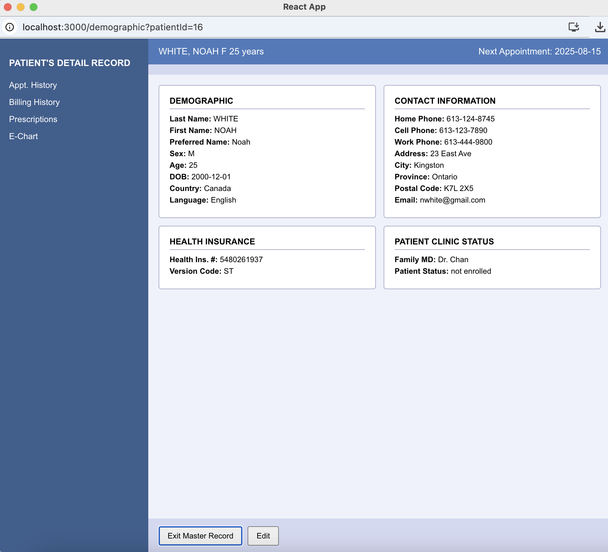
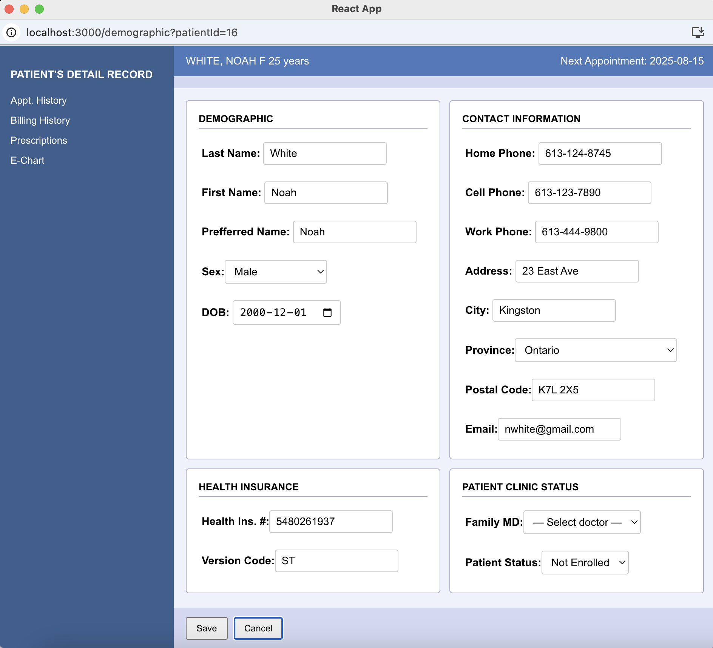
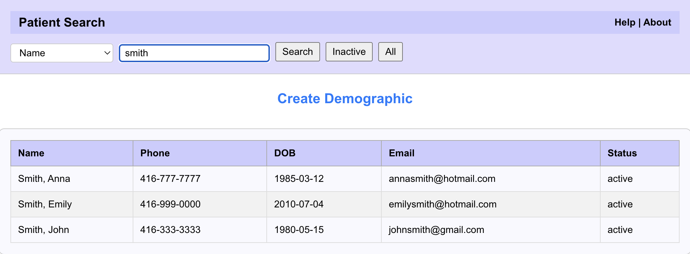

[](LICENSE)

# 🏥 Electronic Medical Record (EMR) System

A modern web-based EMR prototype with appointment scheduling (conflict detection), patient master records, patient search, and role-based flows.

## Features
- Day view with providers & time grid
- Add/Edit/Delete appointments (popup), appointment conflict checks, appointment status workflow
- Patient Master Record (demographics), patient search
- Component tests with React Testing Library + Jest
- Dockerized dev environment

## Tech Stack
React, React Router, RTL/Jest · Node/Express (API) · Docker Compose

## 🚀 Quick Start

**Prerequisites**
- **Docker & Docker Compose** (for the quick start).
- (Optional) **Node.js LTS** (v18+ or v20) if you prefer running locally without Docker

```bash
git clone git@github.com:Alex-Gorman/Electronic-Medical-Record-System.git
cd Electronic-Medical-Record-System
docker compose up --build
```

## 🌐 Access the Application
- Frontend: http://localhost:3000
- API: http://localhost:3002

**Demo Login**
- Username: Admin
- Password: Admin1234


## Architecture
```
.
├─ backend/        # Node/Express API (localhost:3002)
├─ frontend/       # React app (localhost:3000)
└─ docker-compose.yml
```

## Running Tests
- **Node.js** LTS (v18+ or v20 recommended), if running locally without Docker.
- **npm** (bundled with Node — you don’t install it separately)

```bash
cd frontend

# run once
npm test

# watch mode (recommended)
npm run test:watch

# coverage report (outputs coverage/ directory)
npm run test:coverage

# CI mode (no watch, silent logs)
npm run test:ci
```

---


## EMR UI Screenshots

| Add Appointment | Add Demographic Record |
|---|---|
|  |  |

| Calendar Popup | Edit Appointment |
|---|---|
|  |  |

| Login | Main Menu |
|---|---|
|  |  |

| Master Record | Edit Master Record |
|---|---|
|  |  |

| Patient Search |  |
|---|---|
|  |  |


---


## Documentation
- [AppointmentFormPopup component](/docs/AppointmentFormPopup.md)
- [SearchPage component](/docs/SearchPage.md)
- [App - Application Shell & Routing](/docs/App.md)
- [Navbar component](/docs/Navbar.md)
- [CalendarPopup component](/docs/CalendarPopup.md)
- [LoginPage component](/docs/LoginPage.md)
- [MainMenu component](/docs/MainMenu.md)
- [MasterRecord component](/docs/MasterRecord.md)
- [CreateDemographic component](/docs/CreateDemographic.md)
- [Server component](/docs/Server.md)

---

# Testing

## 1. Test Suite Overview

All tests live under ```frontend/src/__tests__/``` and use React Testing Library + Jest with the JSDOM environment.

## 2. Test Documentation (Specs)

- [AppointmentFormPopup Test documentation](/docs/test_plans/AppointmentFormPopup.test.md)
- [CreateDemographic Test documentation](/docs/test_plans/CreateDemographic.test.md)
- [LoginPage Test documentation](/docs/test_plans/LoginPage.test.md)
- [MainMenu Test documentation](/docs/test_plans/MainMenu.test.md)
- [MasterRecord Test documentation](/docs/test_plans/MasterRecord.test.md)
- [Navbar Test documentation](/docs/test_plans/Navbar.test.md)
- [SearchPage Test documentation](/docs/test_plans/SearchPage.test.md)


